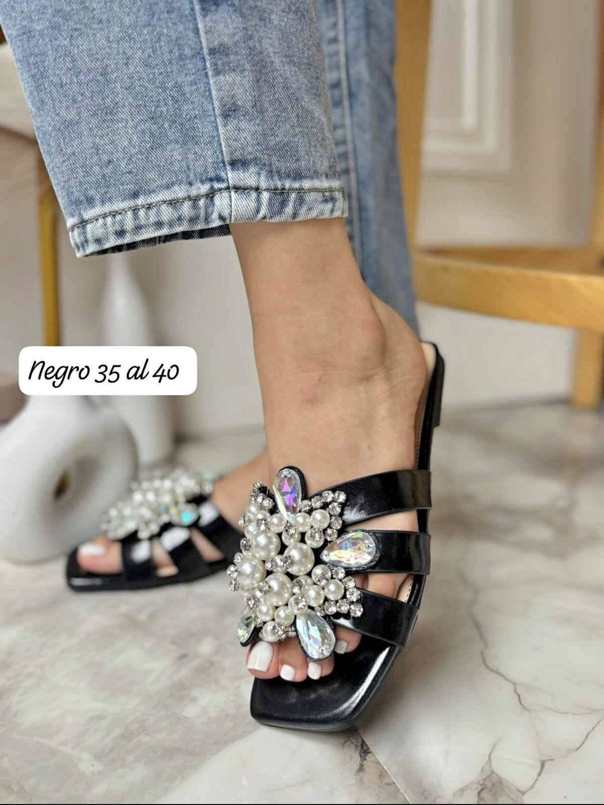
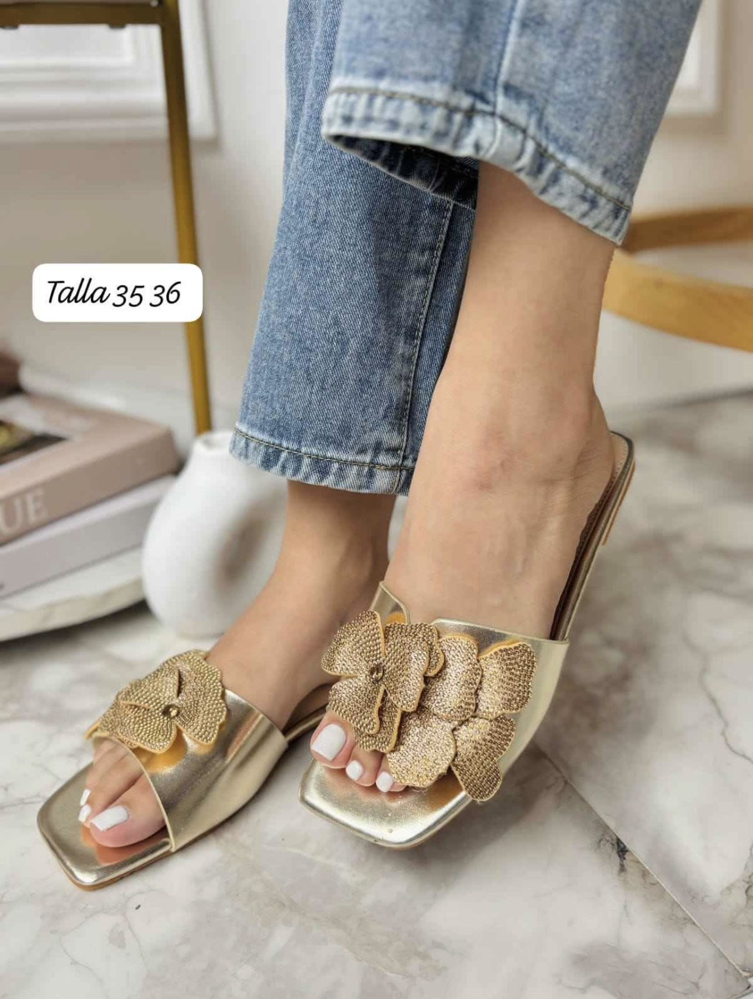
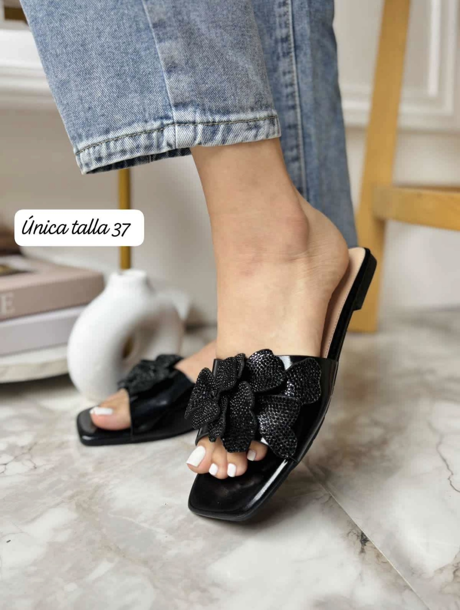

<html>
<head>

</head>
<body>

  

    <h1>BIENVENIDOS </h1>
  

</body>
</html>

<head>

</head>
<body>

  

    
  

</body>

<a href="https://ice2606.github.io/pagina-002/" class="boton-verde">
  <button>atras </button>
</a>

<html>
<head>

</head>
<body>

</body>
</html>

<html>
<head>
<title>Catálogo</title>

</head>
<body>
<table>
  <thead>
    <tr>
      <th>Foto</th>
      <th>Descripción</th>
      <th>Precio</th>
      <th>Comprar</th>
    </tr>
  </thead>
  <tbody>
    <tr>
      <td data-label="Foto"></td>
      <td data-label="Descripción">sandalias con perlas hermosas talla del 35 al 40.</td>
      <td data-label="Precio"></td>
      <td data-label="Comprar"><a href="https://wa.me/+505 8990 6649?text=Hola,%20me%20interesa%20el%20Producto%201%20de%20tu%20sitio%20web." class="whatsapp-link" target="_blank">WhatsApp</a></td>
    </tr>
    <tr>
      <td data-label="Foto"></td>
      <td data-label="Descripción">sandalias color plateado con perlas tallas 35 al 40.</td>
      <td data-label="Precio"></td>
      <td data-label="Comprar"><a href="https://wa.me/+505 8990 6649?text=Hola,%20me%20interesa%20el%20Producto%202%20de%20tu%20sitio%20web." class="whatsapp-link" target="_blank">WhatsApp</a></td>
    </tr>
    <tr>
      <td data-label="Foto"></td>
      <td data-label="Descripción">sandalias color dorado con flores doradas </td>
      <td data-label="Precio"></td>
      <td data-label="Comprar"><a href="https://wa.me/+505 8990 6649?text=Hola,%20me%20interesa%20el%20Producto%203%20de%20tu%20sitio%20web." class="whatsapp-link" target="_blank">WhatsApp</a></td>
    </tr>
  <tr>
      <td data-label="Foto"></td>
      <td data-label="Descripción">sandalias color negro con flores negras del 35 al 40</td>
      <td data-label="Precio"></td>
      <td data-label="Comprar"><a href="https://wa.me/+505 8990 6649?text=Hola,%20me%20interesa%20el%20Producto%201%20de%20tu%20sitio%20web." class="whatsapp-link" target="_blank">WhatsApp</a></td>
    </tr>
  <tr>
      <td data-label="Foto"></td>
      <td data-label="Descripción">sandalias color gris con flores gris del 35 al 40 .</td>
      <td data-label="Precio"></td>
      <td data-label="Comprar"><a href="https://wa.me/+505 8990 6649?text=Hola,%20me%20interesa%20el%20Producto%201%20de%20tu%20sitio%20web." class="whatsapp-link" target="_blank">WhatsApp</a></td>
    </tr>
    </tbody>
</table>
</body>
</html>

