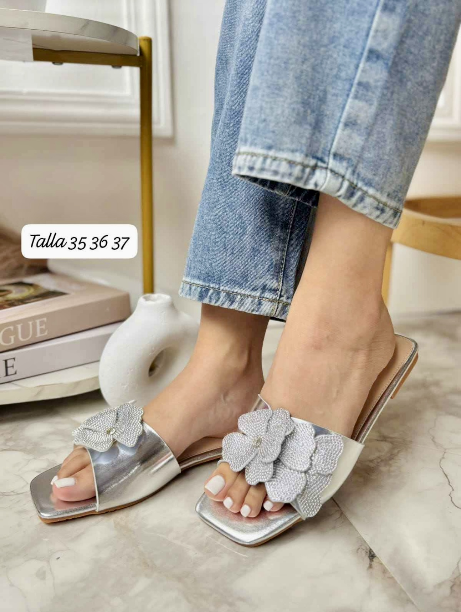

<html>
<head>

</head>
<body>

  

    <h1>BIENVENIDOS </h1>
  

</body>
</html>

<head>

</head>
<body>

  

    
  

</body>

<a href="https://ice2606.github.io/pagina-002/" class="boton-verde">
  <button>atras </button>
</a>

<html>
<head>

</head>
<body>

</body>
</html>

<html lang="es">
<head>
  <meta charset="UTF-8">
  <meta name="viewport" content="width=device-width, initial-scale=1.0">
  <title>Producto Destacado</title>
  
</head>
<body>
  

    
    

      Sandalias con perlas, cómodas y elegantes. Disponibles en tallas 35 al 40.
    

    <a href="https://wa.me/50589906649?text=Hola%2C%20me%20interesa%20el%20producto%20de%20tu%20sitio%20web." class="whatsapp-link" target="_blank">
      Consultar por WhatsApp
    </a>
  

</body>
</html>

<body>
  

    
    

      Sandalias con perlas,color gris ,
      cómodas y elegantes. Disponibles en tallas 35 al 40.
    

    <a href="https://wa.me/50589906649?text=Hola%2C%20me%20interesa%20el%20producto%20de%20tu%20sitio%20web." class="whatsapp-link" target="_blank">
      Consultar por WhatsApp
    </a>
  

</body>

<body>
  

    
    

      Sandalias con perlas, doradas con flor, cómodas y elegantes. Disponibles en tallas 35 al 40.
    

    <a href="https://wa.me/50589906649?text=Hola%2C%20me%20interesa%20el%20producto%20de%20tu%20sitio%20web." class="whatsapp-link" target="_blank">
      Consultar por WhatsApp
    </a>
  

</body>

<body>
  

    
    

      Sandalias con perlas,color negro, comodas  y elegantes. Disponibles en tallas 35 al 40.
    

    <a href="https://wa.me/50589906649?text=Hola%2C%20me%20interesa%20el%20producto%20de%20tu%20sitio%20web." class="whatsapp-link" target="_blank">
      Consultar por WhatsApp
    </a>
  

</body>

<body>
  

    
    

      Sandalias con perlas, color gris con flor ,cómodas y elegantes. Disponibles en tallas 35 al 40.
    

    <a href="https://wa.me/50589906649?text=Hola%2C%20me%20interesa%20el%20producto%20de%20tu%20sitio%20web." class="whatsapp-link" target="_blank">
      Consultar por WhatsApp
    </a>
  

</body>

<html lang="es">
<head>
  <meta charset="UTF-8">
  <meta name="viewport" content="width=device-width, initial-scale=1.0">
  <title>Fondo de Imagen Ajustable</title>
  
</head>
<body>
  

    <h1>Bienvenido</h1>
    
Esta página tiene una imagen de fondo que se ajusta a cualquier pantalla.

  

</body>
</html>

